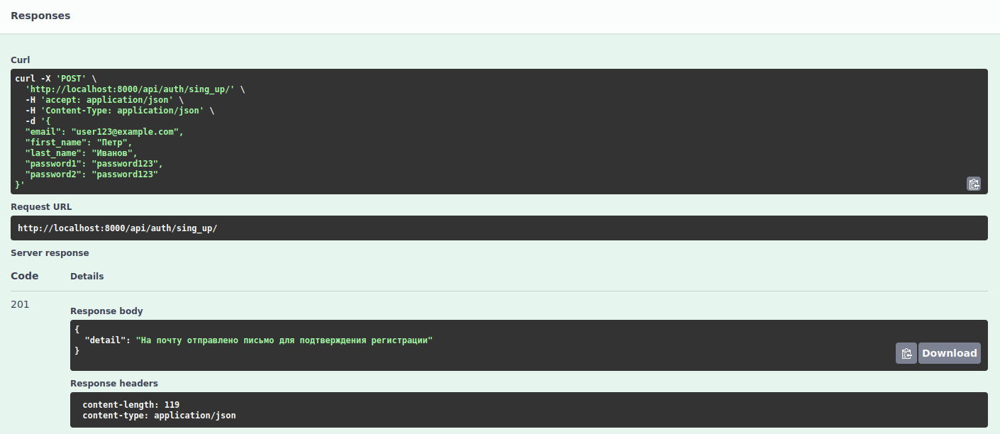
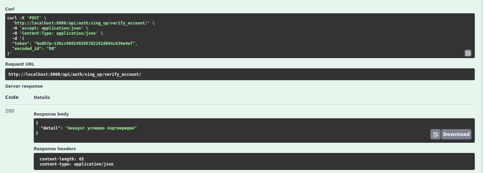
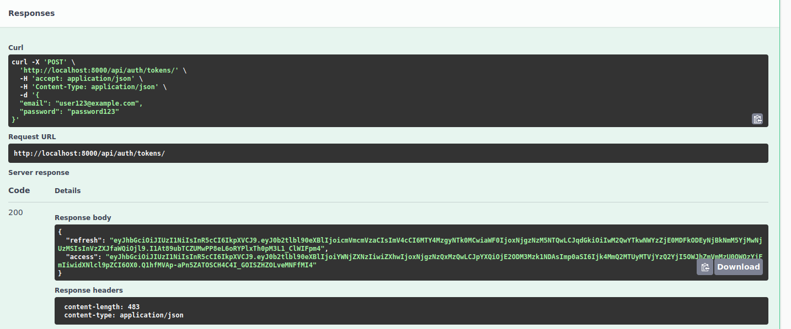
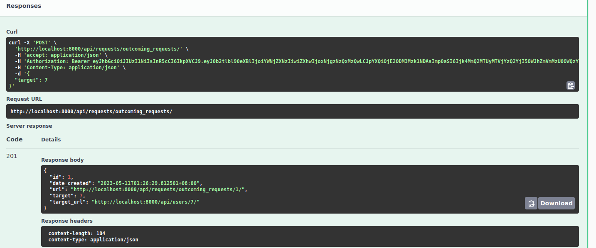
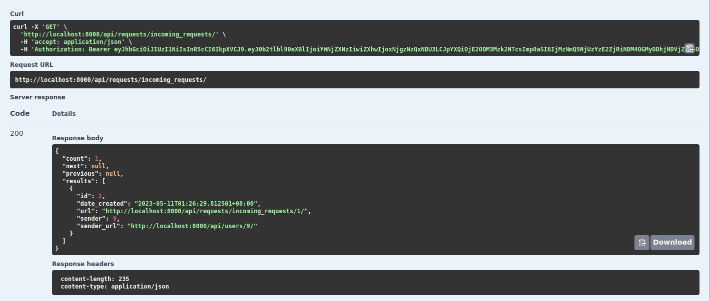
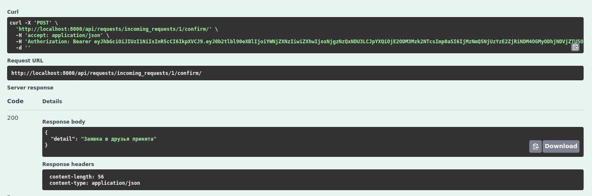
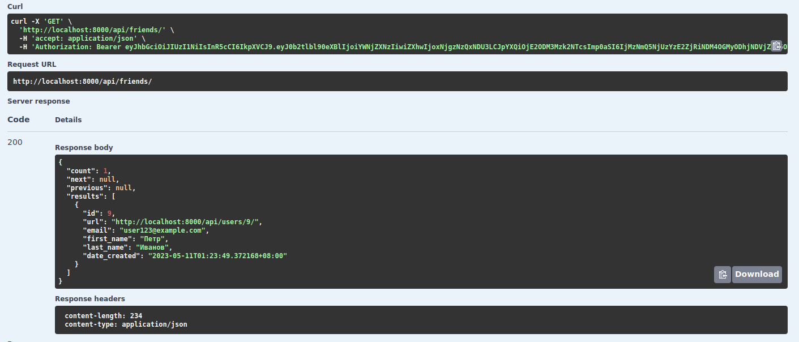
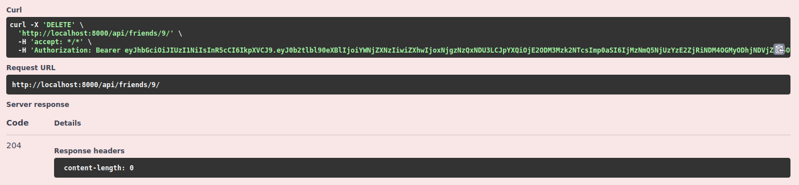
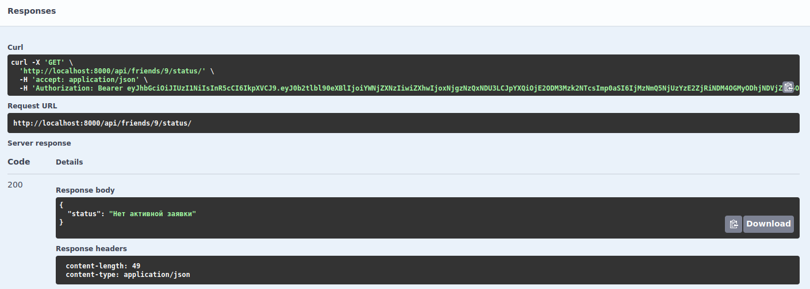

[](https://app.travis-ci.com/SergeiGD/vk-test-friends)
# vk test friends

## Навигация
- [Описание проекта](#описание-проекта)
- [Документация](#документация)
- [Инструкция по запуску](#инструкция-по-запуску)
- [Пример использования](#пример-использования)

## Описание проекта
В данном репозитории содержится тестовое задание от VK для прохождения стажировки.

Было необходимо спроектировать и разработать Django-сервис друзей. В результате работы должны быть: описание REST-интерфейса с помощью OpenAPI, сам код сервиса и краткая документация.

Использованные технологии:
- Python 3.10
- Django 4.2.1
- DRF 3.14.0
- PostgreSQL
- logger
- OpenAPI
- Swagger-UI
- Docker
- Travis CI
- Makefile

Все необходимые команды можно выполнить с помощью утилиты Makefile, перечень команд и их описание доступны в секции "[Инструкция по запуску](#инструкция-по-запуску)".

Проект сопровожден тестами endpoint'ов, также рассчитывается покрытие кода. 

Был реализован CI процесс с помощью Travis CI.

Для удобства тестирования API, в докере был развернут Swagger-UI.

## Документация

Для проекта было создано сразу две спецификации OpenAPI:
1) Написанная вручную - [openapi-manual.yml](./vk_test_friends/doc/openapi-manual.yaml)
2) Автодокументация, созданная с помощью drf-spectacular - [openapi-auto.yml](./vk_test_friends/doc/openapi-auto.yml)

## Инструкция по запуску:

Создайте .env фай со следующим содержимым:
```bash
DB_NAME = имя базы данных
DB_USER = логин к базе данных
DB_PASSWORD = пароль к базе данных
DB_PORT = порт для базы данных (должен быть свободен)
SWAGGER_PORT = порт для swagger-ui (должен быть свободен)
SECRET_KEY = секретный ключ приложения
SEND_EMAILS = булево значение, нужно ли отправлять эл. сообщения (при регистрации/сбросе пароля). По умолчанию False
EMAIL_USER = ваш адрес эл. почты, откуда будут отправляться письма (не нужно, если SEND_EMAILS=False)
EMAIL_PASSWORD = пароль от эл. почты (не нужно, если SEND_EMAILS=False)
EMAIL_HOST = сервер отправителя писем (не нужно, если SEND_EMAILS=False)
```
Пример:
```bash
DB_NAME=friends
DB_USER=sergei
DB_PASSWORD=pass123
DB_PORT=5454
SWAGGER_PORT=8080
SEND_EMAILS=True
EMAIL_USER=mypetauth@yandex.ru
EMAIL_PASSWORD=asldakk234kkasd
EMAIL_HOST=smtp.yandex.ru
SECRET_KEY=django-insecure-mdskmfkmerw32kklas
```

*Если вы не создадите свой .env файл, то будет использоваться содержимое файла [.trevis_env](./.trevis_env)*

Команды Makefile:
1) make build - собрать и запустить проект **(требуется выполнить при первоначальном запуске)**
2) make fixture - создать тестовых пользователей
3) make run - запуск всех контейнеров
4) make stop - остановка контейнеров
5) make doc - сгенерировать (обновить) автодокументацию файл ([openapi-auto.yml](./vk_test_friends/doc/openapi-auto.yml))
6) make test - запуск тестов + отображения процента покрытия кода

После запуска контейнеров приложение будет работать по адресу http://localhost:8000

Swagger-UI будет доступен по адресу http://localhost:ЗНАЧЕНИЕ_SWAGGER_PORT **(по умолчанию http://localhost:8080/)**. В правом верхнем углу, в секции "Select a definition" можно переключаться между ручной и автоматической документацией.

Так как почти все endpoint'ы требуют авторизации, сначала необходимо создать аккаунту. Есть два способа, как это сделать:
1) **Быстрый** - выполнить команду make fixture и использовать любого из пользователей в файле [fixture.json](./vk_test_friends/fixture.json), у всех этих пользователей пароль qweqwe. Например: почта - test1@mail.ru, пароль - qweqwe. **Является оптимальным вариантом, т.к. не придется еще создавать доп. пользователей.**
2) **Долгий** - в swagger-ui выполнить запрос на endpoint auth/sign_up, после этого, если включена отправка писем, на указанную почту придет письмо с ссылкой вида "http://localhost:8000/api/auth/sing_up/verify_account/?id=MzI2&token=bnw1w5-12939390778dc79beb6551da7cfb1adc". Если отправка писем отключена или вам не хочется лезть на почту, вы можете найти это сообщение в файле [email_messages.txt](./vk_test_friends/email_messages.txt). Из этой ссылке возьмите параметр id (MzI2) и токен (bnw1w5-12939390778dc79beb6551da7cfb1adc). После этого сделайте запрос на адрес auth/verify_account, передав полученные в прошлом шаге параметры.


После этого можно получить JWT токены, сделав запрос по адресу auth/tokens, время жизни access токена 30 минут, потом его можно обновить на endpoint'е auth/tokens/refresh или просто повторно пройдя аутентификацию.

Список всех пользователей доступен на endpoint'е users, оттуда вы можете взять любого пользователя и отправить ему запрос в друзья по адресу requests/outcoming_request/ (POST). После этого зайдите под аккаунтом пользователя, которому отправили запрос и примите заявку, это делается на endpoint'е requests/outcoming_request/{id}/confirm/. Выполнив запрос по адресу friends/ можно убедится, что пользователь был добавлен в друзья.

Описание остальных endpoint'ов вы можете узнать с помощью swagger-ui. Рекомендуется использовать ручную документацию, так как там представлено более подробное описание.

## Пример использования

1) Регистрируемся



2) Подтверждаем аккаунт



3) Получаем JWT токены



4) Отправляем заявку 



5) Зайдя под аккаунту пользователя, которому отправили заявку, получаем список входящих заявок



6) Подтверждаем заявку



7) Получаем список друзей



8) Удаляем из друзей



9) Получаем статус дружбы после удаления


